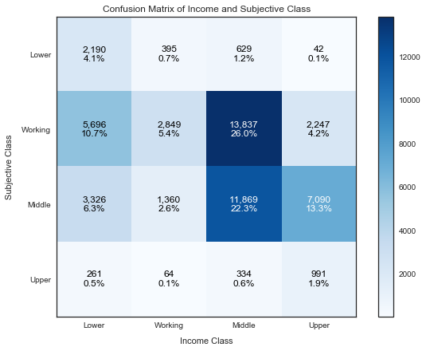
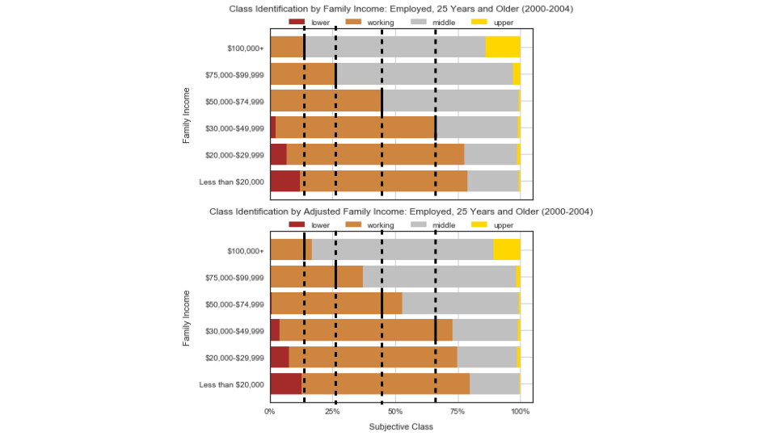

# Subjective Class Compared to Income Class

### Cassandra Overney

## Introduction
In the Urban Institute report, [“The Growing Size and Incomes of the Upper Middle Class”](https://www.urban.org/sites/default/files/publication/81581/2000819-The-Growing-Size-and-Incomes-of-the-Upper-Middle-Class.pdf), Stephen Rose states that
> People tend to live in communities with similar incomes, they view themselves as being near the middle because their neighbors’ circumstances are similar to their own even if their incomes are significantly below or above the US median.

Back in my hometown, many people consider themselves middle class regardless of their incomes. However, whenever my parents or friends talked about class, I always assumed that they were referring to income class. I grew up thinking that income and subjective class were the same things. Now that I know about their differences, I am curious to see whether a discrepancy between subjective and income class exists throughout America. The main question that I want to answer in this project is

#### How does subjective class compare to income class?

Social class is an interesting aspect of American culture that has been extensively studied in the past. In 2007, Michael Hout at UC Berkeley published a paper, ["How Class Works in Popular Conception"](http://ucdata.berkeley.edu/rsfcensus/papers/Hout-ClassIDJan07.pdf), which delves into what factors Americans consider when identifying their class. The paper uses data from the General Social Survey (GSS). Since an important component of data science involves data validation, I plan to compare my results with Hout's to determine whether we reach similar conclusions.

## Methodology and Results
### Data Processing
All of the data I use in this project are from the [GSS dataset](https://gssdataexplorer.norc.org/). The General Social Survey (GSS) is a project of the independent research organization NORC at the University of Chicago, with principal funding from the National Science Foundation.

GSS contains data for almost 6000 variables. The variables that I utilize include:
- `realinc`: family income in 1986 dollars. This variable is a recode created by GSS from the other income variables. It contains data from 1972 to 2016. More information can be found [here](http://gss.norc.org/Documents/reports/methodological-reports/MR064.pdf).
- `class`: subjective class. It contains data from 1972 to 2016 and has 3468 missing cases. The question associated with this variable is, "If you were asked to use one of four names for your social class, which would you say you belong in: the lower class, the working class, the middle class, or the upper class?" Class has four values:
  - 1: lower class
  - 2: working class
  - 3: middle class
  - 4: upper class
- `hompop`: household size. It contains data from 1972 to 2016 and has 6 missing cases. There is no question associated with this variable.
- `year`: year of interview. This is recorded automatically for every respondent, so there are no missing cases.
- `age`: pretty self-explanatory. It contains data from 1972 to 2016 and has 221 missing cases.
- `wrkstat`: labor force status. It contains data from 1972 to 2016 and has 19 missing cases. The question associated with this variable is, "Last week were you working full time, part-time, going to school, keeping house, or what?" There are eight possible values:
  - 1: working fulltime
  - 2: working part-time
  - 3: temp not working
  - 4: unemployed, laid off
  - 5: retired
  - 6: school
  - 7: keeping house
  - 8: other

After some basic data cleaning (substituting `nan` for responses like no answer, don't know, or not applicable), I convert `realinc` into income class.  

According to the [Pew Research Center](http://www.pewsocialtrends.org/2015/12/09/the-american-middle-class-is-losing-ground/#fnref-21084-7), income class can be determined by examining the proportion of a given income to the annual median household income. Upper class corresponds to earning more than double the median income. Middle class corresponds to earning between 2/3 and double the median income. Working (lower-middle) class corresponds to earning between 1/2 and 2/3 the median income, and lower class corresponds to earning less than 1/2 the median income.

The most recent data in GSS is from 2016, which means that the most recent income data is from 2015. As a result, I convert the `realinc` data into constant 2015 dollars using the Consumer Price Index Research Series (CPI-U-RS), which is important for measures of absolute progress over time. For better comparisons, incomes are adjusted for household size and then scaled to reflect a household size of three.

I obtain yearly median incomes (1971 to 2015) in 2015 dollars from the Census Bureau. (The median household size from 1971 to 2015 is 3, so I do not need to adjust the medians for household size.) For each respondent, I compute the proportions between respondent incomes and median incomes (matched by year) and then convert proportions to income classes.

### Pairwise Comparisons

Once I have income classes, I conduct pairwise comparisons to discover what classes respondents with a particular income identify as. I visualize the pairwise comparisons with a confusion matrix (part of `pandas_ml` library), in which income classes are on the x-axis and subjective classes are on the y-axis. Each cell of the 4-by-4 matrix is colored by density.  

  

The following observations can be made regarding the confusion matrix:
- Most of the subjective classes are working or middle class.
- Very few respondents proclaim themselves to be upper class even if their income classes are.
- Respondents from the lower income class are more likely to consider themselves working class than lower or middle class.
- There are not many people in the working income class. Those who are mainly characterize themselves as working class.
- Most respondents lie in the middle-income class and they mainly characterize themselves as either working or middle class (with working class being more common).
- Respondents from the upper-income class are more likely to consider themselves middle and then working class compared to upper class.

Overall, the confusion matrix provides support that most respondents characterize themselves as middle or working class. Income class does not wholly indicate subjective class. However, there are differences in subjective class based on income. For example, respondents in the lowest income class are more likely to consider themselves working class while respondents in the highest income class are more likely to consider themselves middle class.

### Data Validation

After comparing income and subjective class, I attempt to replicate Hout's results. One of the main figures in his paper (Figure 1) shows the distribution of class identification for various family income ranges with a segmented bar graph. My first step in data validation involves replicating Hout's figure. Hout only includes employed respondents 25 years or older (due to absence bias of college students) from 2000 to 2004, so I create a subset of my `gss` dataframe. I define employment as `wrkstat` codes 1 to 3, which include working fulltime, working part-time, and temporarily not working. I also convert `realinc` from 1986 dollars to 2004 dollars (instead of 2015 dollars).

Hout is quite vague regarding his data processing procedure. He does not mention how he adjusts for inflation or defines employment. Furthermore, there is no mention of adjusting for household size. As a result, I generate segmented bar graphs with and without household size adjustment to see how the distribution of subjective class would change with a slight but potentially important modification to the data processing.

The top bar graph does not include household size adjustment and is nearly identical to Hout's Figure 1 with some slight differences in distributions. For example, in the $20,000-$29,999 income range, I found that the proportion of lower and working subjective class is around 77% instead of Hout's 75%. Even so, these differences are quite small and might be due to differing definitions of what it means to be employed and methods to adjust for inflation.

The bottom bar graph contains data adjusted for household size and looks quite different. The largest differences are indicated by the black lines. The distribution of working class increased for the $100,000+, $75,000-$99,999, $50,000-$74,999, and $30,000-$49,999 income ranges. These differences suggest that Hout probably did not adjust his incomes for household size.

Household size is important to consider because a single person making $50,000 per year is very different from a family of five making $50,000 per year. It would be interesting to rerun all of Hout's analyses with this adjustment.

Overall, I was able to replicate Hout's "Class Identification by Family Income" figure and expand on one of his findings with household size adjustments.

## Conclusions
My main takeaways from this project include:
-  Income is not the only factor that Americans associate with class. This finding connects to the idea of "status inconsistencies" in which Americans have flexible, and even multiple, class identities depending on which settings they are in.
- Most respondents consider themselves to be either working or middle class. This might be especially true for respondents with incomes near the cutoff values.
- The method of dealing with income data has an impact on the distribution of subjective class for different income ranges. Specifically, adjustment for household size is important and should be applied to make incomes more comparable.

Some potential next steps include:
- Apply household size adjustment to the rest of Hout's analyses.
- Conduct multinormal logistic regression to see what factors have the most impact on subjective class.
- Identify which classes the respondents with incomes that are not clearly above or below the median identify as.

## Resources
- [ Hout's "How Class Works in Popular Conception"](http://ucdata.berkeley.edu/rsfcensus/papers/Hout-ClassIDJan07.pdf)
- [Pew's "The American Middle Class Is Losing Ground"](http://www.pewsocialtrends.org/2015/12/09/the-american-middle-class-is-losing-ground/#fnref-21084-7)
- [Rose's “The Growing Size and Incomes of the Upper Middle Class”](https://www.urban.org/sites/default/files/publication/81581/2000819-The-Growing-Size-and-Incomes-of-the-Upper-Middle-Class.pdf)
- [2015 Census Bureau Data](https://www.census.gov/library/publications/2016/demo/p60-256.html)
- [Census Bureau CPI-U-RS Data](https://www.census.gov/topics/income-poverty/income/guidance/current-vs-constant-dollars.html)
