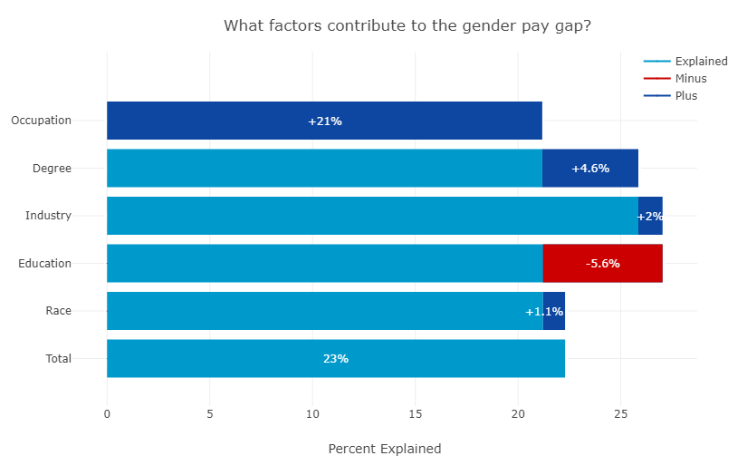
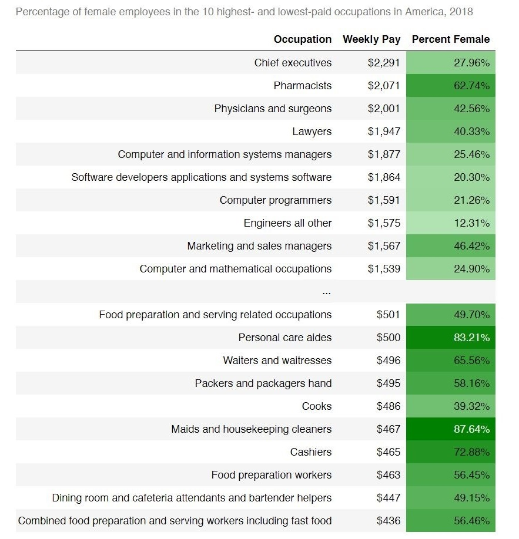
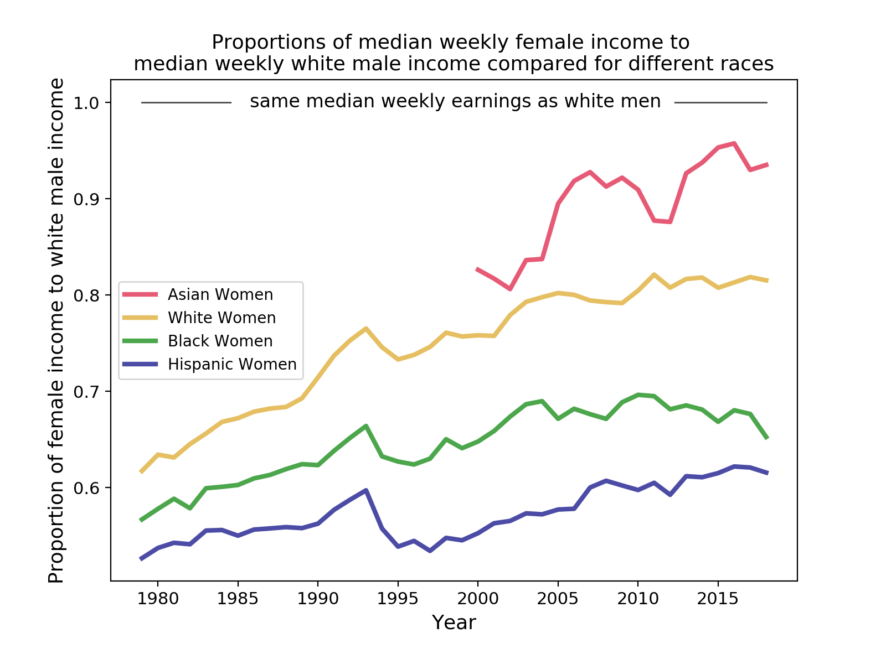
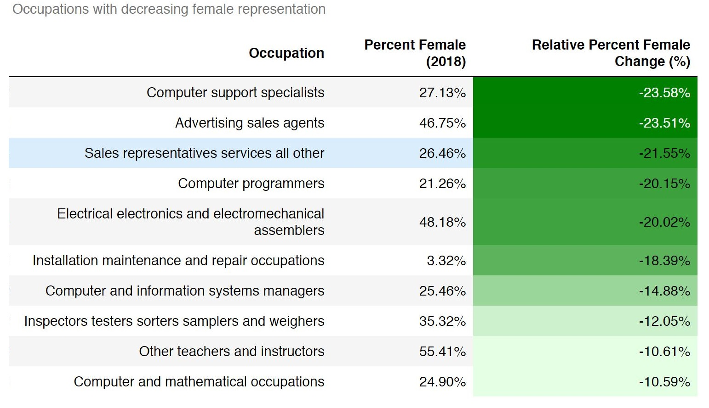
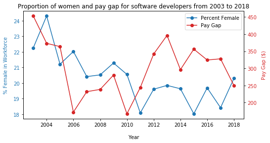

# It’s Still Not the Day for Equal Pay
### Cassandra Overney and Khang Vu

## Introduction
Happy late [Equal Pay Day](https://en.wikipedia.org/wiki/Equal_Pay_Day)! Equal Pay Day in 2019 was on Tuesday, April 2nd, representing the extra three months the average woman has to work into the new year just to make what the average white man earned at the end of 2018. To celebrate, we decided to investigate the gender pay gap (male income - female income), specifically:
- What factors cause the gender pay gap?  
- Is the pay gap the same for all women?
- What is it like for women in STEM?

## Methodology and Results
### Overview of the Data
We use data from two sources, the U.S. Bureau of Labor Statistics (BLS) and IPUMS. With BLS data, we calculate pay gap with median weekly incomes. With IPUMS, we calculate pay gap with mean hourly incomes. According to Pew Research, using weekly incomes is better when focusing on specific segments of the labor market, while using hourly incomes is better when focusing on the overall pay gap for working women and men.      

#### BLS
We obtain median weekly income data from the Current Population Survey (CPS), which is a monthly survey of 60,000 households conducted by the Bureau of Census for the BLS. The terms of use can be found [here](https://www.bls.gov/developers/termsOfService.htm).

CPS is the primary source of labor force statistics for the U.S. population. The data for median weekly income for males and females of different races is [here](https://www.bls.gov/webapps/legacy/cpswktab3.htm). Median weekly incomes are found as annual averages for full-time wage and salary workers 16 years and over and are not seasonally adjusted. Wage and salary workers for earning purposes exclude both the incorporated and the unincorporated self-employed. People who selected more than one race group are also excluded.

Median earnings are found from usual weekly earning distributions, which reflect earnings before taxes and other deductions. The question associated with usual weekly earnings is:

*“I have estimated (your/his/her) usual WEEKLY earnings (as/for (your/his/her) main job as) (AMOUNT) before taxes or other deductions. Does that sound correct?”*

The term “usual” means as perceived by the respondent. The estimation component of the question is present because respondents can report earnings in the time periods they prefer.   

The data for median weekly income for males and females of different occupations is [here](https://www.bls.gov/cps/tables.htm). Occupation describes a person's job or the type of work they do and are based on the job they held during the survey [reference week](https://www.bls.gov/cps/definitions.htm#refweek). The median incomes are derived from annual average data.

#### IPUMS
For regression analysis, we downloaded respondent CPS data from [IPUMS USA](https://usa.ipums.org/usa/cite.shtml) for 2017.

As part of the licensing agreement for use of IPUMS USA data, we added a citation of our report to the [IPUMS bibliography](https://bibliography.ipums.org/). IPUMS directly collected its 2017 data from the Bureau of Census. We did all of our IPUMS analysis on 1.5 million employed full time workers. The variables we study include:
- `INCWAGE`: reports each respondent's total pre-tax wage and salary income - that is, money received as an employee - for the previous year.
- `WKSWORK2`: reports the number of weeks that the respondent worked for profit, pay, or as an unpaid family worker during the previous year.
- `UHRSWORK`:  reports the number of hours per week that the respondent usually worked, if the person worked during the previous year.
- `DEGFIELDD`: reports the field in which the person received a Bachelor's degree, if the person holds a Bachelor's degree.
- `OCC2010`: reports the occupation of the respondent using [the Census Bureau's 2010 ACS occupation classification scheme](https://usa.ipums.org/usa/volii/occ_acs.shtml).
- `RACED`: reports respondents’ races in full detail.
- `IND`: reports the type of industry in which the person performed an occupation.

IPUMS provides annual wage from the prior calendar year, along with the number of weeks the respondent worked during the previous year and the usual hours worked per week. From these variables, we estimate an hourly wage, `HRLY_INCWAGE`, for respondents who work more than 30 hours a week for at least 27 weeks in 2017. We also eliminate all hourly income values below $2.0 because most of them are probably errors.

### What Causes the Gender Pay Gap?
As of 2018, women still earn just 81% of what men make. 81% corresponds to the proportion of median weekly female income ($789) to median weekly male income ($973). The pay gap persists, despite more women earning college degrees and entering the workforce at higher pay rates, because of several factors, one of the largest being sex segregation. Sex segregation corresponds to the division between which occupations and industries men and women tend to work in.  

We used the Blinder–Oaxaca decomposition to analyze the 2017 IPUMS USA data and quantify the impact that different factors have on the gender pay gap.

  

[The Blinder–Oaxaca decomposition](https://en.wikipedia.org/wiki/Blinder%E2%80%93Oaxaca_decomposition) provides a way to analyze the mean income gap by deconstructing the gap into explained and unexplained factors. For each explanatory variable, we calculate the explained percentage that contributes to the general total pay gap. As a simple example, we view education as an explained factor that helps reduce the pay gap. In 2017, women have a higher mean education level than men, according to the IPUMS data. If we give a woman, who has a mean female education level (~15 years), the same privilege as a man having a mean male education level (~14 years), she would earn more than the average man because she has higher education. This explains how education reduces the pay gap by 5.6%. For other factors like occupation and industry, which are not encoded in a way that allows us to take the means of the male and female groups, we sort them ascendingly based on the mean hourly income and re-encode them accordingly. As a result, the mean female occupation and industry code will reflect the common occupation and industry that attract more women than men and correspond to sex segregation. The proportion attributable to sex segregation can be found by adding the proportions associated with occupation and industry, resulting in 23%.

Furthermore, for some occupations, especially management positions, when women become more represented, the pays for those jobs tend to go down. Using CPS data from 2003 to 2018, we examine the relationship between sex segregation and pay for both males and females over time. The occupations with increasing percentages of females and decreasing median weekly incomes include:
- Insurance sales agents (+16.3%, -15.5%)
- General and operations managers (+15.3%, -13.9%)
- Postal service mail carriers (+27.7%, -12.5%)
- Purchasing managers (+15.3%, -10.2%)
- Lawyers (+28.0%, -8.8%)
- Food service managers (+14.8%, -8.8%)

We found that a 15% to 30% increase in the proportion of women working in these occupations was associated with those jobs’ weekly wages dropping by between 9% and 16% over 16 years.

Even more alarming, sex segregation has a negative impact on gender pay gap since the jobs that are frequently done by women consistently pay less.            

  
    

Of the 10 highest paid occupations in America, just four have at least 40% females with only Pharmacists having more than 50% female. Of the 10 lowest paid occupations, they all have at least 40% females. Personal care aides and maids have over 80% female. This shows that women are doing the jobs that pay the least.     

### Unequal Pay Gap for Women of Different Races
The gender pay gap is not the same for all women. It is worse for some minorities, especially black and Hispanic women. To visualize the differences in pay gap for women of different races, we use CPS median weekly incomes for varying genders and races from 1979 to 2018. We plot the proportions of female income compared to white male income for each race. We pick white male income since it is the highest weekly income that is represented for the entire time period.   

  
   

None of the lines have proportions greater than or equal to 1. Asian women income is closest to white male income with proportions ranging from around 0.8 to 0.95. White women have proportions ranging from 0.6 to 0.8. Black and Hispanic women make a little more than half of what white men make.

Though the pay gap has narrowed over time, it is still divided by race. In recent years, race plays an even larger role in explaining the pay gap than it did 40 years ago. While white and Asian female incomes have moved much closer to white male incomes, black and Hispanic women have not seen as much of a decrease in their pay gaps. This could be due to differences in occupations and education levels.

### We Need More Women in STEM!
Since both of us are going to enter the workforce soon as engineers, we wanted to study whether sex segregation and gender pay gap improved for different STEM occupations. Despite efforts in encouraging young women to enter STEM fields, STEM occupations have some of the highest decreases in female representation. With CPS data from 2003 to 2018, we generate a table of the occupations with the most negative relative percent female changes, sorted in ascending order. Relative percent female change is found by first finding the difference between the proportion of women working in a certain occupation in 2018 with the proportion in 2003 and then dividing the absolute difference by the proportion in 2003.              

  

An example of an occupation with a decrease in the proportion of females and gender pay gap is software developers. We visualize these relationships with a two-scale plot of percent female and pay gap from 2003 to 2018.    

  

For software developers, as the percentage of women in the occupation decreases over time, the pay gap between male and female median income also decreases. The percentage of female software developers decreased from around 22.3% to 20.3% (8.8% decrease), while the pay gap decreased from \\$453 to \\$250 (44.8% decrease). This means that as women become less represented in these jobs, men continue to make more, but the differences are lower now than they were in the past. This could potentially be due to the increasing awareness of gender imbalance within high tech companies. In recent years, women began to file lawsuits against companies like [Google](https://money.cnn.com/2018/01/03/technology/google-gender-pay-lawsuit-revised/index.html), [Oracle](https://www.wired.com/story/analysis-finds-oracle-paid-women-13000-less-than-men/), and [Uber](https://www.forbes.com/sites/bizcarson/2017/10/26/three-women-engineers-sue-uber-claiming-unequal-pay-discrimination/#2999778d5bd7), accusing the companies of paying them less than men.   

### Conclusions
Our findings can be summarized with the following:
- Sex segregation is attributable to 23% of the gender pay gap.  
- For a few occupations, as women become more represented in a job, the pay for the job tends to go down.
- In 2018, the percentages of women working in the 10 lowest paid occupations in America were higher on average than the percentages of women working in the 10 highest paid occupations.  
- From 1979 to 2018, male income was consistently higher than female income, but the pay gap did narrow over time, especially for Asian and white females.
- In recent years, race plays an even larger role in explaining the pay gap than it did in the past.
- More STEM related occupations are associated with a decrease in female representation, especially for computer occupations.

The gender pay gap is still an important issue that will take a substantial amount of time to resolve. Women have already made a lot of progress on the individually controllable factors that contribute to pay gap, such as education. However, these changes are not enough to erase the pay gap or to cause a paradigm shift in how society and employers value the work women do compared to men.

Some potential next steps include:
- Delving into more recent STEM occupation data to see how effective various women in STEM programs are. For example, we could ask where the first cohort of Girls Who Code members go when they enter the workforce.  
- Comparing the gender pay gap in the US with the pay gaps in other countries. Some interesting articles on this topic can be found [here](https://www.weforum.org/agenda/2017/11/pay-equality-men-women-gender-gap-report-2017/) and [here](https://www.weforum.org/agenda/2019/04/gender-pay-gap-eight-countries/).  

## Resources
- *IPUMS USA, University of Minnesota, www.ipums.org.*
- “CPS Tables.” *U.S. Bureau of Labor Statistics*, U.S. Bureau of Labor Statistics, 18 Jan. 2019, [www.bls.gov/cps/tables.htm](http://www.bls.gov/cps/tables.htm).
- “Table 3. Median Usual Weekly Earnings by Age, Race, Hispanic or Latino Ethnicity, and Sex.” *U.S. Bureau of Labor Statistics*, U.S. Bureau of Labor Statistics, 16 Sept. 2015, [www.bls.gov/webapps/legacy/cpswktab3.htm](http://www.bls.gov/webapps/legacy/cpswktab3.htm).
- [“How Pew Research measured the gender pay gap”](https://www.pewresearch.org/fact-tank/2013/12/11/how-pew-research-measured-the-gender-pay-gap/)
- [“The Gender Wage Gap: Extent, Trends, and Explanations”](https://www.econstor.eu/bitstream/10419/130341/1/dp9656.pdf)
- [“Occupational Feminization and Pay: Assessing Causal Dynamics Using 1950-2000 U.S. Census Data”](http://www.statisticalhorizons.com/wp-content/uploads/2012/01/88.2.levanon.pdf)
