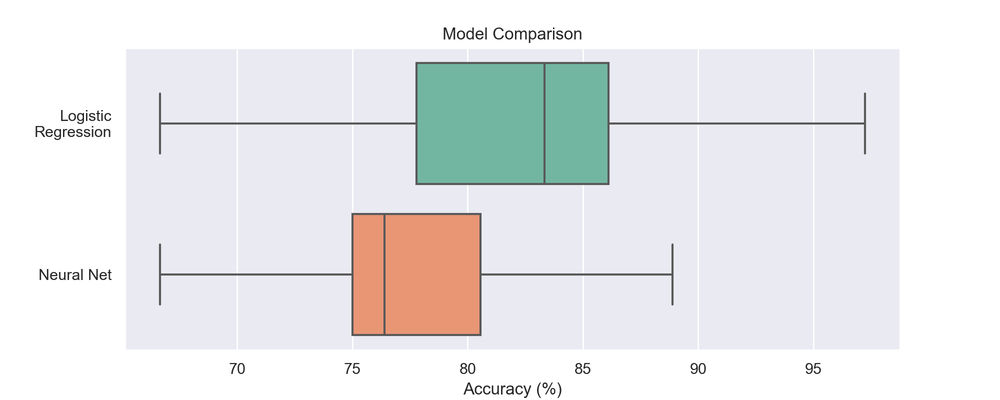

## Goodbye Machine Learning, Hello Logistic Regression

#### Cassandra Overney and Khang Vu

Recently, there has been an increase in using complicated machine learning techniques to address data science questions. Machine learning is a powerful tool in that we do not need to have a thorough understanding of the data. Instead, deeper neural networks can find increasingly complex patterns in a dataset, a process known as representation learning. Sometimes, these models have high prediction accuracies. However, in other cases, especially for clinical prediction models, simpler techniques like linear and logistic regression work just as well, if not better.

Using data from the [Machine Learning with a Heart](https://www.drivendata.org/competitions/54/machine-learning-with-a-heart/page/109/) DrivenData competition, we found that logistic regression results in higher accuracy for predicting the presence of heart disease compared to more complicated machine learning techniques.

The Machine Learning with a Heart competition uses the Statlog Heart dataset, which is part of the [UCI Machine Learning Repository](http://archive.ics.uci.edu/ml/datasets/statlog+(heart)). The terms of use are [here](http://archive.ics.uci.edu/ml/citation_policy.html). The data has 14 variables including:
- `heart_disease_present` (type: `binary`): whether the patient has heart disease or not
- `slope_of_peak_exercise_st_segment` (type: `int`): the slope of the peak exercise [ST segment](https://en.wikipedia.org/wiki/ST_segment), an electrocardiography read out indicating quality of blood flow to the heart
- `thal` (type: `categorical`): results of [thallium stress test](https://www.ucsfbenioffchildrens.org/tests/007201.html) measuring blood flow to the heart, with possible values normal, fixed_defect, reversible_defect
- `resting_blood_pressure` (type: `int`): resting blood pressure
- `chest_pain_type` (type: `int`): chest pain type (4 values)
- `num_major_vessels` (type: `int`): number of major vessels (0-3) colored by flourosopy
- `fasting_blood_sugar_gt_120_mg_per_dl` (type: `binary`): fasting blood sugar > 120 mg/dl
- `resting_ekg_results` (type: `int`): resting electrocardiographic results (values 0,1,2)
- `serum_cholesterol_mg_per_dl` (type: `int`): serum cholestoral in mg/dl
- `oldpeak_eq_st_depression` (type: `float`): oldpeak = [ST depression](https://en.wikipedia.org/wiki/ST_depression) induced by exercise relative to rest, a measure of abnormality in electrocardiograms
- `sex` (type: `binary`): 0: female, 1: male
- `age` (type: `int`): age in years
- `max_heart_rate_achieved` (type: `int`): maximum heart rate achieved (beats per minute)
- `exercise_induced_angina` (type: `binary`): exercise-induced chest pain (0: False, 1: True)

### Machine Learning Approach
We build a [neural network]((https://keras.io/layers/core/) using Keras as a high-level API for TensorFlow. The neural network has 4 layers:
- First hidden layer using `relu` activation function consists of 17 neurons
- Second hidden layer using `relu` activation function consists of 21 neurons
- Third hidden layer using `relu` activation function consists of 25 neurons
- Final output layer using `softmax` activation function layer consists of 2 neurons to classify the two classes (heart disease present or not)

Additionally, we apply **L2 regularization (Ridge)** to each layer and use **early stopping** to address the possibility of over-fitting. We use `categorical_crossentropy` loss as a general loss function for any classification problems. Because our training data has only a dozen of features and 144 samples and the optimizer tends to over-fit the model more quickly than Stochastic Gradient Descent (SGD), we choose SGD with the tuned learning rate of 0.008.

### Logistic Regression Approach
A benefit of using logistic regression is the ability to interpret the results. Each parameter from regression is associated with an independent variable. As a result, it is important to have a thorough understanding of the data we are working with. After studying the distributions of each variable with and without heart disease presence, we found that `oldpeak_eq_st_depression` is zero inflated (highly skewed to the right with a peak in probability occurring at 0, reference figure below). Between the presence of heart disease groups in `oldpeak_eq_st_depression`, the non disease group has a higher peak at 0.

We deal with the zero inflation by creating a binary variable `have_oldpeak`, which would be 0 if a patient has a 0 old peak value and 1 if they don’t. We set the 0 `oldpeak_eq_st_depression` values to `np.nan` since they would already be represented in `have_oldpeak`.

  

With this change, the distribution of `oldpeak_eq_st_depression` is still skewed to the right but not as much.

We can use logistic regression to see the impact of `have_oldpeak` on predictive power. We conduct simple logistic regression with `heart_disease_present` as the dependent variable and each feature as the explanatory variable. Running 13 to 14 simple logistic regressions allows us to see which explanatory variables can better predict the presence of heart disease. For each variable, we construct a model and compute R-squared. The higher the R-squared value, the more predictive power the corresponding variable has.

Without `have_oldpeak`, the variables that affect `heart_disease_present` the most are `thal`, `exercise_induced_angina`, and `chest_pain_type`. `thal` has a predictive power of around 22.2%; `exercise_induced_angina` has a predictive power of around 15.1%, and `chest_pain_type` has a predictive power of around 14.0%. For comparison purposes, `oldpeak_eq_st_depression` has a predictive power of around 11.8%.     

With `have_oldpeak`, the variables that affect `heart_disease_present` the most are still `thal`, `exercise_induced_angina`, and `chest_pain_type` with the same predictive powers. However, the predictive power of `oldpeak_eq_st_depression` increases from 11.8% to 12.4%. `have_oldpeak` has a predictive power of around 3.4%. The increase in `oldpeak_eq_st_depression`’s predictive power indicates that creating `have_oldpeak` can help with logistic regression.

Using what we learned from exploratory data analysis, we can run [logistic regression](https://scikit-learn.org/stable/modules/generated/sklearn.linear_model.LogisticRegression.html) using `scikit-learn`.

### Comparing Machine Learning and Logistic Regression
We compare the two methods by generating accuracy distributions. For the logistic regression model, we ran 1000 simulations with data shuffling and a 80:20 train/test data split. For the machine learning model, we ran 50 simulations due to time constraints. We display the two accuracy distributions with a boxplot.

  

Logistic regression has a higher median accuracy than the neural network (83% compared to 76%). It also has a higher upper bound (97% vs 89%), but the same lower bound (around 66%).  

Since the Statlog Heart dataset is relatively small (14 features and 144 samples), a simpler model (logistic regression) worked pretty well. Machine learning approaches tend to over-fit fairly quickly for small datasets. Additionally, machine learning requires more time to develop/train the model and tune the hyperparameters. The results are also harder to evaluate and compare. Machine learning has some positives too in that it provides more flexibility.   

In terms of next steps, we plan to contribute our analyses to the DrivenData competition.                      

### Resources
- [Jupyter Notebook](https://github.com/coverney/ThinkStats2/blob/master/project3/project3.ipynb)
- Aha, D., and Dennis Kibler. "Instance-based prediction of heart-disease presence with the Cleveland database." University of California 3.1 (1988): 3-2.
- Christodoulou, Evangelia. [“A systematic review shows no performance benefit of machine learning over logistic regression for clinical prediction models.”](https://www.sciencedirect.com/science/article/pii/S0895435618310813)
